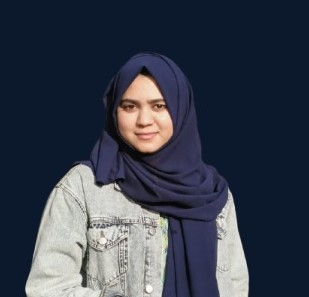

<h1 align="center">Hi 👋, I'm Muqadas Urooj</h1>
<h3 align="center">A Passionate React Native & Web Developer from Pakistan</h3>

---

 
   

---

### 🔥 About Me:

- 🧠 Started as an **Android Developer** (Java, XML, SQL, PHP)  
- 🚀 Now building apps with **React Native** (cross-platform mobile development)  
- 🔧 Focused on UI/UX, Firebase integration, and performance  
- 🎯 Always learning and exploring new tech trends  

---

### 🌍 Connect with Me:

  
  &nbsp;&nbsp;
  

---

### 🛠️ Skills & Tools:

#### 📌 Mobile & Web Development:

  
  &nbsp;&nbsp;
  
  &nbsp;&nbsp;
  
  &nbsp;&nbsp;
  
  &nbsp;&nbsp;
  

---

### 🧩 Experience

- 💼 **DZS Solutions** — *Junior React Native Developer* (Mar 2025 – Present)  
- 💼 **Programmers Lab** — *React Native Developer* (Nov 2024 – Jan 2025)  
- 💼 **SYSTAFF** — *Web Design Intern* (Jul 2023 – Aug 2023)

---

### 🎓 Education

**Bachelor in Computer Science**  
Rawalpindi Women University  
*(2020 – 2024)*

---

### 📊 GitHub Stats:

  

  

  

